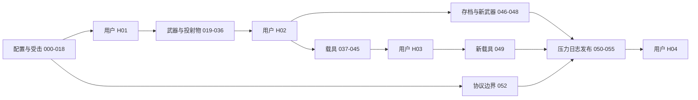

# M5 数据驱动战斗扩展总计划

版本：讨论版 1.0；日期：2026-10-06（Asia/Shanghai）。本轮交付规划文档，不实现功能、不领取任务、不修改已有验收状态。

## 1. 阅读入口

1. 本文件：范围、阶段、任务依赖和并行分工。
2. [系统设计](M5-系统设计.md)：配置结构、执行流程、迁移和错误处理。
3. [接口约定](M5-接口约定.md)：公共契约及首次定义任务。
4. 下表中的独立任务卡：前置、文件范围、步骤、验收、命令和报告路径。
5. 原有 [执行与交接规则](执行与交接规则.md)：提交、总表、人工验收和证据规则。

本计划不是第二张状态表。M5 卡暂不含执行状态，正式授权执行后由 M5-000 登记到 `TASKS.md`；唯一状态来源始终是 TASKS。

## 2. 目标与边界

**在已经实现的行为能力内，新增武器、子弹、受击策略和单座地面载具，只增加配置、资源引用和验收样例，不增加针对具体 ID 的 C++ 分支。** 新行为类型仍需扩展通用执行器。以两项“只改表新增内容”实证，而不是把配置文件存在当作完成。

子弹属于投射物 Projectile，可驾驶车辆属于载具 Vehicle。本计划包含两者，载具首版限定为可占用、可驾驶、可挂武器的单座地面平台，支持 X/Y 纵深移动。飞机、船、多人座位和复杂刚体驾驶属于后续能力。

当前仓库已有近战命中、硬直、上挑浮空、倒地恢复和死亡复位。本阶段配置化并统一已有路径，不重写第二套状态机。M4-000 保留服务端接入职责；M5 不实施网络预测、Replication 或服务器。

采用唯一 JSON 源表，验证后生成 UE Cook 资产。CSV 编辑工具可后续引入，不能同时维护两份权威源表。正式包不读开发 `Data` 目录；本轮不承诺运行时热更新。资源使用现成免费/引擎附带素材。

## 3. 粒度与分段

- 59 项技术/流程卡（M5-000..055，加018A/018B/020A）和 4 项人工关卡（M5-H01..H04），共 63 张独立卡。
- 每卡一个可独立拒绝的结果，目标 30-90 分钟实现工作，不含编译/下载等待；超出时先拆子卡并更新依赖。
- 依赖为明确的 AND 列表。模型、配置、生产接线、真实输入和发布验收分开，不能仅用替身测试称游戏内完成。
- 每项报告执行时创建，不预填 PASS、未来 SHA 或人工认可。

| 段 | 范围 | 可玩交付 | 开始下一段的关卡 |
|---|---|---|---|
| A 配置与受击 | 000..018，含018A/018B；020A可预先迁移旧内容 | 合法源表生成/重载；旧四招统一入口；普通/重型策略、浮空倒地可调 | H01 后开始 019 |
| B 武器与投射物 | 019..036，含020A生产目录适配 | 装备、弹药换弹、单发/连射/点射、射线/直线/抛物线/追踪、穿透爆炸、键鼠和 UI | H02 后开始 037、046 |
| C 地面载具 | 037..045 | 单座进入、驾驶、炮塔、受击、退出，复用伤害和武器 | H03 后开始 049 |
| D 成长与发布 | 046..055 | 老档迁移、重启重挂、只改表新增武器/载具、压力日志、最终包 | H04 综合验收 |

052 是独立的协议边界文档，可在 012 后并行；存档线 046..048 可与载具线并行。

020A属于旧Item/Drop生产源迁移，018A之后可在H01前完成，不提前新增武器能力；新的装备/火器行为仍从H01后的019开始。034显式等待020A，H02必须覆盖真实获取和装备链。

## 4. 任务索引

本表只列范围和依赖，不维护进度。独占文件和共享集成点见各卡。

| 卡片 | 交付结果 | 前置 |
|---|---|---|
| [M5-000](M5-000.md) | 编号和并行领取接入总表 | M3-H01,M3-030,M3-031,M3-032 |
| [M5-001](M5-001.md) | 基线回归和迁移清单 | M5-000 |
| [M5-002](M5-002.md) | ID/时钟/事件/状态/所有权契约 | M5-001 |
| [M5-003](M5-003.md) | 伤害/反应/目标抗性配置结构 | M5-002 |
| [M5-004](M5-004.md) | 武器/弹药/投射物配置结构 | M5-002 |
| [M5-005](M5-005.md) | 源表解析与字段校验 | M5-003,M5-004 |
| [M5-006](M5-006.md) | 跨表 ID/Tag/资源引用校验 | M5-005 |
| [M5-007](M5-007.md) | 只读 Catalog 和版本摘要 | M5-003,M5-004 |
| [M5-008](M5-008.md) | 源表生成 UE 资产 | M5-006,M5-007 |
| [M5-009](M5-009.md) | 重启重载与 Cook 引用 | M5-008 |
| [M5-010](M5-010.md) | 实体 ID 和事件去重 | M5-002 |
| [M5-011](M5-011.md) | 纯函数伤害解析 | M5-003 |
| [M5-012](M5-012.md) | 统一命中应用入口 | M5-007,M5-010,M5-011 |
| [M5-013](M5-013.md) | 当前近战适配统一入口 | M5-009,M5-012 |
| [M5-014](M5-014.md) | 硬直/击退/浮空读取策略 | M5-003,M5-013 |
| [M5-015](M5-015.md) | 免疫/韧性/浮空衰减 | M5-014 |
| [M5-016](M5-016.md) | 倒地/起身/复位配置化 | M5-014 |
| [M5-017](M5-017.md) | 受击表现映射和图片验证 | M5-015,M5-016 |
| [M5-018A](M5-018A.md) | 通用配置试验房与菜单入口 | M5-009,M5-017 |
| [M5-018](M5-018.md) | A 段生产受击场景回归 | M5-018A |
| [M5-018B](M5-018B.md) | A 段独立包与人工清单 | M5-018 |
| [M5-H01](M5-H01.md) | 用户受击/浮空/倒地验收 | M5-018B |
| [M5-019](M5-019.md) | 背包实例绑定武器定义 | M5-H01,M5-007 |
| [M5-020](M5-020.md) | 配置挂载和装备切换 | M5-019,M5-009 |
| [M5-020A](M5-020A.md) | Item/Drop/HUD生产目录适配 | M5-007,M5-008,M5-009,M5-018A |
| [M5-021](M5-021.md) | 弹匣/备弹和装填模型 | M5-019 |
| [M5-022](M5-022.md) | 单发准入和原子扣弹 | M5-020,M5-021,M5-010 |
| [M5-023](M5-023.md) | 连射节流和松键停止 | M5-022 |
| [M5-024](M5-024.md) | 三连发与中断 | M5-022 |
| [M5-025](M5-025.md) | 多弹丸/散布/发射点 | M5-022 |
| [M5-026](M5-026.md) | 射线武器三维命中 | M5-012,M5-025 |
| [M5-027](M5-027.md) | 投射物生成和生命周期 | M5-004,M5-020,M5-025 |
| [M5-028](M5-028.md) | 直线运动和高速连续碰撞 | M5-027,M5-012 |
| [M5-029](M5-029.md) | 抛物线运动 | M5-028 |
| [M5-030](M5-030.md) | 追踪和丢失目标 | M5-028 |
| [M5-031](M5-031.md) | 穿透/过滤/命中组 | M5-028 |
| [M5-032](M5-032.md) | 单次爆炸/衰减/遮挡 | M5-028,M5-011 |
| [M5-033](M5-033.md) | 真实输入与武器生产接线 | M5-020,M5-023,M5-024,M5-026,M5-031,M5-032 |
| [M5-034](M5-034.md) | 装备选择/弹药/换弹界面 | M5-020A,M5-033 |
| [M5-035](M5-035.md) | 多类型武器生产场景 | M5-029,M5-030,M5-034 |
| [M5-036](M5-036.md) | B 段包与真输入清单 | M5-035 |
| [M5-H02](M5-H02.md) | 用户武器/子弹验收 | M5-036 |
| [M5-037](M5-037.md) | 地面载具源表校验 | M5-H02,M5-006 |
| [M5-038](M5-038.md) | 载具生成/Catalog 接入 | M5-037,M5-008 |
| [M5-039](M5-039.md) | 载具耐久/阵营/销毁 | M5-038,M5-012 |
| [M5-040](M5-040.md) | 座位占用/进入/退出模型 | M5-037 |
| [M5-041](M5-041.md) | 输入交接和安全下车 | M5-039,M5-040 |
| [M5-042](M5-042.md) | 载具 X/Y 移动/边界/镜头 | M5-041 |
| [M5-043](M5-043.md) | 武器挂点/炮塔限制 | M5-039,M5-025,M5-033 |
| [M5-044](M5-044.md) | 载具完整生产场景 | M5-042,M5-043 |
| [M5-045](M5-045.md) | C 段包和试玩入口 | M5-044 |
| [M5-H03](M5-H03.md) | 用户地面载具验收 | M5-045 |
| [M5-046](M5-046.md) | 老存档 v1 到 v2 迁移 | M5-H02,M5-019,M5-021 |
| [M5-047](M5-047.md) | 保存点/装备弹药重启恢复 | M5-046,M5-020 |
| [M5-048](M5-048.md) | 只改表新增武器实证 | M5-047,M5-035 |
| [M5-049](M5-049.md) | 只改表新增载具实证 | M5-H03,M5-038 |
| [M5-050](M5-050.md) | 投射物压力和生命周期预算 | M5-035 |
| [M5-051](M5-051.md) | 载具切换/退出长时清理 | M5-044 |
| [M5-052](M5-052.md) | MMO 事件映射边界文档 | M5-012 |
| [M5-053](M5-053.md) | 统一事件日志 | M5-035,M5-044 |
| [M5-054](M5-054.md) | 全链/源表隔离发布验证 | M5-048,M5-049,M5-050,M5-051,M5-052,M5-053 |
| [M5-055](M5-055.md) | 配置作者手册和最终交接 | M5-054 |
| [M5-H04](M5-H04.md) | 用户综合成长/配置扩展验收 | M5-055,M5-H02,M5-H03 |

## 5. 并行调度

总表只由协调者写；依赖必须已合并并在协调分支标 DONE。各 worktree 基于相同已集成契约，分别构建；UE 写资源进程仅一个。共享文件改动由指定集成任务串行合并。

| 已完成节点 | 可派任务 | 冲突约束 |
|---|---|---|
| 002 | 003、004、010 | 分别所有 DamageTypes、WeaponTypes、TargetRegistry |
| 003 | 004、011 | 伤害计算器不编辑武器类型 |
| 005 | 006、007 | Validator 与 Catalog 分文件 |
| 012 | 013、052 | 052 仅设计文档 |
| 014 | 015、016 | 都改 CombatComponent，实际修改必须串行；只能并行准备测试 |
| 019 | 020、021 | 生产挂载与 AmmoModel 分文件 |
| 022 | 023、024、025 | 分策略文件；公共 WeaponComponent 接线串行 |
| 028 | 029、030、031、032 | 分行为策略；Projectile Actor 挂点串行 |
| H02 | 037、046、050 | 载具表、存档、压力测试分目录 |
| 038 | 039、040 | VehicleActor 与 SeatModel 分文件 |
| 041 | 042、043 | 移动与炮塔分组件；角色/地图集成串行 |
| 044 | 045、051、053 | 发布、压力、日志证据各自隔离，打包只在集成目录 |

## 6. 正式执行规则

M5-000 先扩展脚本的编号校验、阶段统计并登记卡片。并行模式须记录不同 worktree、独占文件、Owner 和集成顺序；默认仍串行，同一目录最多一个进行中的实现。没有支持并行校验前不能登记多个 IN_PROGRESS。该流程变更的独立卡包含校验验收。

每卡继承原报告模板、实现/状态两次提交规则，以及每一项更新、每三项或退出交接规则。人工关卡由用户签字；没有签字只暂停依赖它的任务。既有 M1-H01 状态不自动改签，M4-000 不自动解除 DEFERRED。

## 7. 通用完成标准

- C++ 完整 Build；资源保存、重启重载；可视变更 Render 并实际查看本次图片。
- 定向自动化 matched>0、failed=0、incomplete=0、summary.success=true；文档卡按其文档核对验收，不能假称测试已执行。
- A/B/C/D 产物记录时间戳、实际提交和 ConfigRevision。原始证据在 `Artifacts/Tasks/<ID>/<timestamp>`，仓库报告保留关键断言和数值。
- 坐标 X/Y/Z 和固定侧面镜头不变，优先用 UE 成熟查询/Movement 能力，不手写物理内核。
- 发布包整目录交付，记录总大小、实际游戏 exe、容器文件及 SHA256；小型根启动 exe 大小不能证明包损坏或完整。
- 用户主流程有真实输入与 UI；控制台仅辅助调试。自动 C++ 驱动不等同真实键鼠试玩。
- M5 本地技术完成不等于完成 MMO。

## 8. 首版范围控制

首版包含近战/射线/可见弹道、单发/连射/点射、多弹丸、穿透/爆炸，支持普通、重型和 Boss 抗性策略。蓄力、持续光束、反弹、地雷、穿墙爆炸、任意脚本效果、附件、耐久衰减新公式、载具持有存档、多人座位和经济系统作为后续能力拆卡。已有 ItemInstance 等级、RollSeed、属性及实例 ID 保留。
