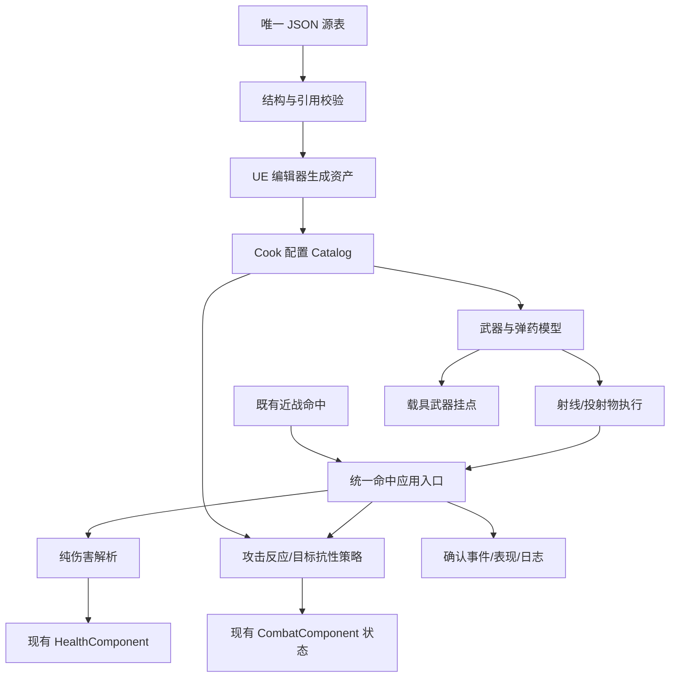

# M5 数据驱动战斗与装备系统设计

版本：讨论版 1.0；2026-10-06。本文是预期行为，实际状态看 TASKS，接口看 [M5-接口约定](M5-接口约定.md)。

## 1. 取舍

采用“配置资产 + 有限能力策略 + 既有战斗组件适配”。直接往角色堆 WeaponId 分支会造成重复，完整更换 GAS/全新战斗框架会扩大现有回归风险；本轮在当前框架上扩展。以后确需迁移时单独立项，不把 GAS 当本阶段前提。

配置可以定义已有能力的参数和组合，不能执行任意代码。新增直线枪、霰弹枪、火箭和重型敌人是加表；新增反弹轨迹、持续光束或飞行驾驶是先加通用能力再加表。以 M5-048/049 的差异证明边界。

## 2. 架构与所有权



- 定义：不可变、按 ID 查找的 Catalog；生命周期为 GameInstance，不持有 World Actor。
- 物品：复用 FItemInstance/背包/装备引用。ItemId 到 WeaponId 的配置映射把训练剑等旧实例连到武器；同一实例的弹药状态独立，卸下仍留在 Profile。
- 攻击：UCombatComponent 继续负责动作状态和计时，HealthComponent 继续负责生命和单次死亡；新策略解析器只提出反应请求，不能另养一个 HitStun/Downed 计时器。
- 世界：实体注册表、投射物和载具归 World；EndPlay/退出/重试使旧 Epoch 失效并撤销弱引用、定时器、输入。
- 存档：只保存业务值，不保存 Actor/投射物、正在倒地的瞬态、座位占用或载具世界实体。首版载具属于关卡会话资源，未定义玩家持有经济。

## 3. 当前实现迁移

当前 CombatComponent 已有 Free/Attacking/HitStun/Knockdown/Recovering、bDead、上挑/落地保护。目标仍保持三个正交维度：生命 Alive/Dead；地面 Grounded/Rising/Falling；动作 Free/Attacking/HitStun/Knockdown/Recovering。免疫、霸体、韧性作为策略/覆盖标志，不混成替代动作的大枚举。

M5-001 记录真实函数和调用者。M5-013 将旧近战命中一次性适配统一应用入口；旧 OnHitConfirmed 保持为兼容事件，由入口结果桥接一次，不从新旧两条路径分别扣血。M5-014/016 把硬编码参数改为解析结果；Reset、死亡、AI/移动门控和动画读取既有状态。旧四招时间/伤害默认不变，用户未确认前不随意调参。

## 4. 配置数据契约

权威源为 `Data/CombatSystem/*.json`；文件外层有 schema_version=1、表名和 rows。业务 ID 用小写 ASCII `a-z0-9_`，1-64 字符，表内唯一；引用用 ID。Tag 必须在 `tags.json` 注册，不让拼写错误自动注册。尺寸 cm、速度 cm/s、角度度、时间秒，只有旧动作窗口仍以 60Hz 帧计。

| 表 | 主键与核心字段 | 首次所有者 |
|---|---|---|
| damage_profiles | damage_profile_id、base_damage、attack_coefficient、penetration、crit_multiplier、damage_type | 003 |
| attack_reactions | reaction_id、hit_stun_s、knockback_cm_s、launch_cm_s、poise_damage、downed_s、getup_s、hitstop_s、control_penetration | 003 |
| target_reactions | policy_id、immune_damage_tags、resistance_by_tag、allow_launch、allow_knockdown、max_launches、launch_scales、max_air_time_s、poise_max、poise_regen_s、air_damage_scale | 003 |
| presentations | presentation_id、montage/音效/特效软路径、placeholder 标志 | 003 |
| weapons | weapon_id、item_definition_id、attack_ids 或 projectile_id、damage_profile_id、reaction_id、fire_mode、fire_interval_s、burst_count/interval、pellet_count、spread_deg、muzzle_offset/socket、presentation_id、ammo_id、magazine_size、reload_s | 004 |
| ammo_types | ammo_id、display_name、starting_reserve、max_reserve | 004 |
| projectiles | projectile_id、movement、speed、gravity_scale、life_s、radius_cm、max_range_cm、penetration_count、explosion_radius_cm、edge_scale、homing_accel、lost_target_action、mesh/effect、target_filter_id | 004 |
| target_filters | filter_id、allowed_team_relations、required_tags、excluded_tags、block_world | 004 |
| tags | tag_id，允许的分类和说明 | 002/006 |
| vehicles | vehicle_id、mesh、max_hp、defense、target_policy_id、speed_x/y、accel、seat_id、mount_ids、camera_offset、spawn_offset | 037 |
| vehicle_seats | seat_id、entry_radius、seat_offset、exit_offsets、can_drive、can_fire | 037 |
| vehicle_mounts | mount_id、weapon_id、ammo_initial、socket/offset、yaw_min/max、pitch_min/max | 037 |

载具配置在 C 段才纳入目录；A/B 段校验不依赖 V 表。manifest 显式列 required_tables，不能因为车辆暂不存在拒绝 A 段，也不能因为将来表未知而静默忽略拼写错误。

源表读写用结构化 JSON API；错误包含 table/row/id/field/error_code。拒绝未知字段、重复键、重复 ID、非有限数、负生命/时间、无效枚举、缺引用、循环引用和不支持的组合。字段默认值由 Schema 显式定义，不拿缺武器当训练剑回退。

已有 `Data/items.json`、`Data/drops.json` 继续分别作为物品/掉落的唯一源，005将其规范化，007给现有FItemDefinitionCatalog/FDropTable提供Cook只读适配，008同时生成。020A将HUD物品展示和RewardService固定三件替身改为目录查询。试验房manifest含奖励池、目标布局和载具spawn列表，现有清关Claim取得新增武器；载具按列表循环生成。这样新增Item/Drop/Vehicle配置才有实际获取/出生入口。新目录revision覆盖这两份既有源，不能仅哈希weapons.json。

近战可不填 ammo/projectile；射线不生成 Actor；直线/抛物线/追踪为可见弹道。penetration_count=0 是首目标后终止，N 是额外可穿越目标数；世界实体阻挡即终止。首版爆炸禁止同时穿透，避免一个弹丸多次爆炸；半径0无爆炸。追踪目标丢失后只支持直线继续或销毁；无反弹/任意脚本。单发、连射、点射为首版模式，无蓄力字段。

## 5. 示例与配置扩展

```json
{
  "schema_version": 1,
  "table": "weapons",
  "rows": [{
    "weapon_id": "rifle_training",
    "item_definition_id": "weapon_rifle_training",
    "projectile_id": "bullet_linear",
    "damage_profile_id": "physical_10",
    "reaction_id": "light_stun",
    "fire_mode": "automatic",
    "fire_interval_s": 0.15,
    "pellet_count": 1,
    "spread_deg": 2,
    "ammo_id": "ammo_light",
    "magazine_size": 12,
    "reload_s": 1.2,
    "muzzle_offset": [65, 0, 100],
    "presentation_id": "rifle_placeholder"
  }]
}
```

所有样例只是测试初值，M5-004 补齐全部 Schema 可选字段和样例；ConfigRevision 由规范化源数据与 Schema 计算 SHA256。同数据重排对象键不改变 revision，行按 ID 排序；实例绑定当前不可变 revision，一局中不得更换目录。

M5-048 添加 scatter_training：复用多弹丸/直线/伤害策略，增加 Item、Drop/测试房配置，生成资产，新进程可见、装备并开火。C++ 文件哈希必须与前次相同。M5-049 同样增加一个速度/耐久/挂载武器不同的载具配置，不修改车辆 Actor。

## 6. 开火/命中/伤害流程

统一ActionSequence由WorldRegistry按(Epoch,SourceEntity)分配，近战/火器/载具共用，不直接用各模块都从1开始的局部序列做Key。旧AttackInstanceId/ShotSequence仅作关联字段；同来源不同能力不会被错误去重。

近战首版attack_ids严格为现有四招完整集合，换装备改变属性/外观/策略，不更换X/Z路由或取消链。未知集合在源表校验拒绝。任意近战AttackSet切换后续另拆任务，不能配置字段存在却静默忽略。

输入 -> 装备解析 -> 状态/冷却/弹药准入 -> 预留全体弹丸容量 -> 分配 ShotId -> 原子扣弹和更新冷却 -> 发射 -> 查询命中 -> 阵营过滤 -> 幂等 -> 伤害解析 -> 扣血/控制 -> 确认事件。

准入或全部弹丸预留失败时不扣弹、不推进射击序列；发射后打空正常消耗。一次霰弹发射扣一发，每弹丸有 PelletIndex。每目标一条 EventId；独立弹丸可重复伤害同一目标，但只施加一次该 Shot 的浮空/倒地控制。重发事件不重复伤害。

DamageRequest 传 DefinitionId 和权威所需上下文，不接受外部未验证的 final_damage。原型 LocalAuthority 在本机裁决。输入不绕过配置和运行态；未来服务器将重新检查来源、技能、位置、弹药和命中，本地 GUID 不是可信认证。

非爆炸物理伤害默认沿用当前公式：`max(1, round((base+attack*coefficient)*100/(100+max(0, defense-penetration))))`，再按配置的暴击、抗性、空中/距离倍率计算；非有限数/溢出拒绝。全免疫可以使实际伤害0。控制是否可生效单独返回，纯控制请求走独立类型，不能伪造伤害1。旧默认攻击10/14/18/12、不装备100→46，训练剑+5一致。

目标策略决定“能否施加请求”：霸体阻止控制但仍可扣血；伤害免疫阻止伤害；起身保护默认拒绝整次命中。接受的伤害、接受的控制、被拒原因分别记录；只有实际扣血>0才桥接旧 OnHitConfirmed，纯控制用 ControlConfirmed。

## 7. 受击与时间

- 硬直叠加取剩余与新时长最大值，重复 EventId 不延长；有效攻击中断时旧 Instance 不再命中。
- 浮空周期落地重置，默认最多2次、系数1.0/0.7；第三次可扣血但无上挑。最大空中时长到达后撤销额外控制、切入下落，不把角色瞬移到地面。
- 普通跳跃不进入倒地；被受击标记的空中落地才进入 Knockdown。默认倒地0.45秒、Recovering0.25秒，延续现状。
- Poise 为目标策略的独立状态，削减/恢复仅影响反应接受与否；Boss 不可浮空/倒地仍能正常扣血。首版无空中受身、起身攻击或墙壁连招。
- control_penetration只允许none/bypass_poise，后者只跳过韧性门槛，不绕过allow_launch/allow_knockdown或起身免疫；max_air_time_s为有界正数，默认取001复核的既有浮空基线，样例不得将目标挂在空中无限期。
- 输入/硬直截止沿用项目现有输入游戏时钟和 HitStop 规则；火器冷却、弹道寿命、追踪使用 Pause 冻结的 World 游戏时间，不受某一角色 HitStop 影响。二者不比较，网络用 SimulationTick 另记录，不挪用 UTC。
- 连射积压不在卡顿后补射整串，一帧最多一发；点射子弹按间隔逐个准入，死亡/切换/换弹取消剩余。松键停止连射，点射已开始的3发可继续，但状态中断必须停止。

## 8. 物理和空间

复用 UE 查询与 Movement；每个投射物运动只有一个推进者，不能同时手写积分和组件 Tick。高速弹道对 previous→current 做半径 Sweep，命中按行程距离排序；30/60/120FPS 与一次100ms卡顿都不能穿过薄墙。Y 不锁定，朝向只镜像X，muzzle_offset 是角色脚底坐标。

爆炸中心到目标有3D距离和世界遮挡查询；中心倍率1、边界edge_scale、超过半径不伤害。World+友军过滤必须先于应用；一条爆炸每目标一次。表现使用真实 Actor、已有材质/音效，禁止“图片有子弹”而实际命中查询未接线。

## 9. 本地装备、弹药和存档

Profile 保存 WeaponInstanceId -> magazine 状态，以及 AmmoId -> reserve；同种弹药备弹共享，同实例弹匣独立。旧武器不填 ammo，行为保持近战。首装每个新实例从starting_reserve初始化一次，重复打开背包/切装备不发弹。

B 段先验证会话内正确性，持久化由 D 段完成并在说明中明示，不将 B 段宣称存档完成。v1→v2 是显式迁移：保留角色/物品/装备/奖励幂等 ID，缺武器状态按定义兼容初值初始化一次；v1 原槽保留直至 v2 写新槽并读回且索引提交。

未知新版本、损坏槽、缺 DefinitionId 明确拒绝并保留文件，不静默丢物品或清档。Claim 保存继续复用 A/B 服务；装备和回菜单/退出用同服务触发保存，失败可重试并提示“未保存”。不每发子弹写盘；崩溃只能保证最后成功提交点，不声称断电时每发弹药都保存。

历史合法例外明确登记：旧HUD可能把饰品写为accessory_training，而Data源为charm_training。manifest用legacy_item_aliases列映射，046迁移只改Definition引用，保留实例ID/已roll属性/装备/奖励幂等，不重新铸造或清理。未知未登记定义仍拒绝，避免所谓兼容掩盖损坏。

重启/换地图从等级、装备和Catalog重新计算属性，自动绑定装备武器；不再依赖玩家卸下再穿上。瞬态攻击/换弹/投射物和载具不恢复。

## 10. 载具首版

v2存档跨ConfigRevision升级按业务ID和状态约束判断：新目录只增行且兼容时允许旧档加载，重绑当前定义但不重新发初始弹；Ammo类型变化、容量小于当前弹量等不兼容变化拒绝并保留原槽，除非有显式迁移。M5-048用旧revision已耗弹档验证新增内容，不新建档绕过兼容。

一个地面平台、一个座位、一个炮塔挂点。车辆启用X/Y移动，Z按地面碰撞处理，不做飞行或跳跃。进入原子检查距离、座位和车辆生命；玩家绑定座位时关闭角色移动/攻击，按座位路由到车辆，退出恢复控制。

沿 exit_offsets 顺序做胶囊落点/地面检查，全部阻塞时拒绝主动下车；销毁必须解除控制并将存活驾驶员送到房间安全点，不遗留无Pawn控制器。第一次致死只发一次 Room/Vehicle 事件；地图卸载清座位和挂点弱引用。

炮塔遵守yaw/pitch限制，操作者阵营决定伤害归属；空车用自身阵营。武器/弹道共用角色执行器，坐车不另发“直接扣血”路径。驱动实体、操作者、车辆EntityId同时记录。

## 11. 生产流程与分段证据

现有箭头/X/Z/C/F2保留。在M5试验房复用Q技能槽1为远程开火（正式数据有角色武器绑定才生效），T为换弹、V为进入/退出；没有武器时Q维持原意图。任务033校验冲突、按下/松开和UIOnly门控；034/045以UI呈现弹药、装备与载具操作，不靠控制台造物。

配置驱动试验房提供近战/射线/直线/抛物线/追踪/爆炸样例与普通/重型目标，所有开火由生产绑定触发；fixture可以准备场景但不能直接扣血冒充命中。H01..H04用户操作走真实键鼠。

压力预算初值：1080p，本机记录GPU/CPU，10目标+200并发投射物，稳定60秒；p95游戏线程≤16.7ms，p99≤33.3ms，超阈值如实FAIL或经用户明确修订预算。场景销毁后注册实体/投射物/定时器归基线，无100轮循环持续增长。物理不承诺跨平台确定性，只对同配置同测试种子的纯计算做一致性。

每段包分目录 `Artifacts/Tasks/<ID>/<timestamp>/Package/Windows`；保存Build、Automation、事件JSON、Render截图、Cook/config revision、整包manifest。显示实际通过/跳过/源表测试排除名单，M5生产测试不得豁免。根启动exe常为小体积，完整性按整包判断。

## 12. 未来 MMO

DamageRequest 是请求，DamageOutcome 是本地确认；Source/Target业务ID、Epoch、Shot/AttackId、Tick和ConfigRevision可映射到现有服务端。服务器提供消息去重范围、Tick单位、版本兼容和权威决定后才做适配。首版不把本机碰撞或随机数当服务器裁决，也不增加虚构协议客户端。
